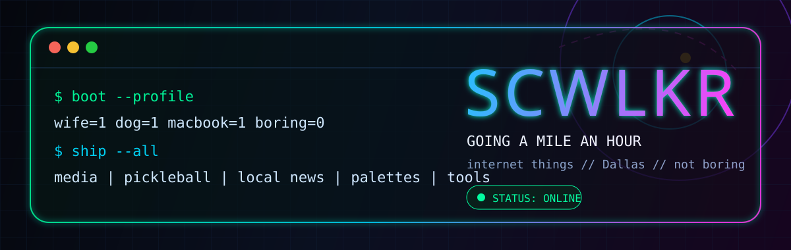

<!--
  scwlkr GitHub profile README
  Drop this file into: https://github.com/scwlkr/scwlkr/blob/main/README.md
  Drop ./assets/hero.svg into the same repo.
-->

<div align="center">
  
  <br><br>
  <a href="https://scwlkr.com">
    
  </a>
  <a href="https://github.com/scwlkr?tab=repositories">
    
  </a>
  <a href="https://context.scwlkr.com/llms.txt">
    
  </a>
</div>

<h1 align="center">internet things, built at irresponsible velocity</h1>

<p align="center">
  <b>not a vibe coder</b> · Dallas, TX · wife/dog/MacBook · <code>n00b until proven guilty</code>
</p>

```console
$ whoami
scwlkr — builder of useful/weird internet machines

$ mission
ship tiny companies, local internet, tools with ominous names, and whatever refuses to leave my head

$ current_status
going a mile an hour
```

---

## 🛰️ mission control

<table>
  <tr>
    <td width="50%">
      <h3>🛫 <a href="https://themediahangar.com">The Media Hangar</a></h3>
      <p>Real estate media in DFW.</p>
      <p><code>real estate</code> <code>media</code> <code>DFW</code></p>
    </td>
    <td width="50%">
      <h3>🥒 <a href="https://dinkboys.com">Dink Boys</a></h3>
      <p>Pickleball brand.</p>
      <p><code>brand</code> <code>pickleball</code> <code>sport</code></p>
    </td>
  </tr>
  <tr>
    <td width="50%">
      <h3>🗞️ <a href="https://www.dffwdaily.com">DFFW Daily</a></h3>
      <p>Local news for Dallas–Fort Worth.</p>
      <p><code>local news</code> <code>DFW</code> <code>TypeScript</code></p>
    </td>
    <td width="50%">
      <h3>🎨 <a href="https://palettewow.xyz">PaletteWOW</a></h3>
      <p>A color palette generator. Open source, visual, immediately useful.</p>
      <p><code>colors</code> <code>HTML</code> <code>open source</code></p>
    </td>
  </tr>
</table>

---

## ⚔️ public lab / project armory

| Project | Stack | Signal |
|---|---:|---|
| [scwlkr-context](https://github.com/scwlkr/scwlkr-context) | Python | Public context harness for agents and collaborators. |
| [paletteWOW](https://github.com/scwlkr/paletteWOW) | HTML | Color palette generator; open source for all. |
| [Walk-The-World](https://github.com/scwlkr/Walk-The-World) | TypeScript | Walk around the world or something. |
| [dffwdaily](https://github.com/scwlkr/dffwdaily) | TypeScript | Local DFW news orbit. |
| [HH-Website](https://github.com/scwlkr/HH-Website) | TypeScript | Site build in the public lab. |
| [QuickBrakeRepair](https://github.com/scwlkr/QuickBrakeRepair) | HTML | HTML site in the public lab. |
| [HealthyServerMac](https://github.com/scwlkr/HealthyServerMac) | Swift | Swift utility; watch the skies. |
| [OpenAlfredo](https://github.com/scwlkr/OpenAlfredo) | TypeScript | Better to serve, than be served. |
| [DeathOfPrompt](https://github.com/scwlkr/DeathOfPrompt) | TypeScript | The end of prompting. |
| [contubernium](https://github.com/scwlkr/contubernium) | Zig | Sometimes you need an army. |
| [scwlkr](https://github.com/scwlkr/scwlkr) | Markdown | This profile’s command center. |
| [bubbashq](https://github.com/scwlkr/bubbashq) | TypeScript | TypeScript thing in the hangar. |
| [ctb-translator](https://github.com/scwlkr/ctb-translator) | Python | Converts Civil3D CTB plot styles to an Excel-printable version. |
| [scwlkr.github.io](https://github.com/scwlkr/scwlkr.github.io) | Web | GitHub Pages orbit. |
| [pickled-paddles](https://github.com/scwlkr/pickled-paddles) | JavaScript | JavaScript thing in the public lab. |
| [shanecwalker](https://github.com/scwlkr/shanecwalker) | Config | Legacy GitHub profile config files. |

---

## 🧰 stack in the toolbox

<div align="center">
  
  
  
  
  
  
  
  
</div>

---

## 📡 telemetry

<div align="center">
  
  
</div>

---

<details open>
  <summary><b>🧪 black box flight recorder</b></summary>

```txt
INPUT   : ideas that should not exist yet
OUTPUT  : tiny companies, local internet, color machines, server helpers, ominous tools
RULE    : boring profiles are a bug
STATUS  : shipping
```

</details>

---

<div align="center">
  <h3>find me where the weird stuff gets shipped</h3>
  <p>
    <a href="https://scwlkr.com">website</a>
    ·
    <a href="https://github.com/scwlkr?tab=repositories">repos</a>
    ·
    <a href="https://context.scwlkr.com/llms.txt">public context</a>
  </p>
</div>
