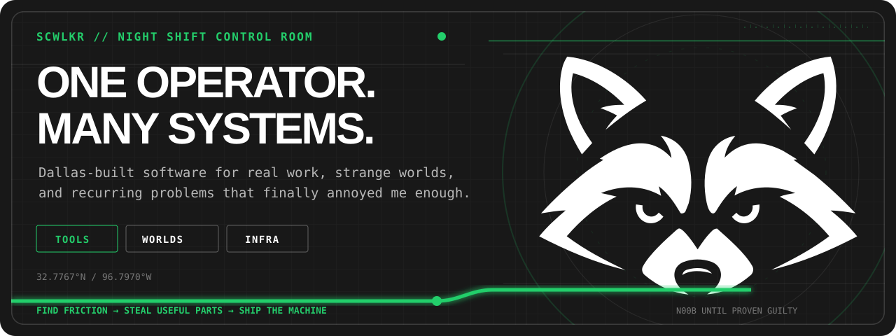
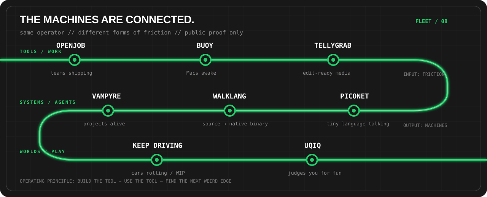
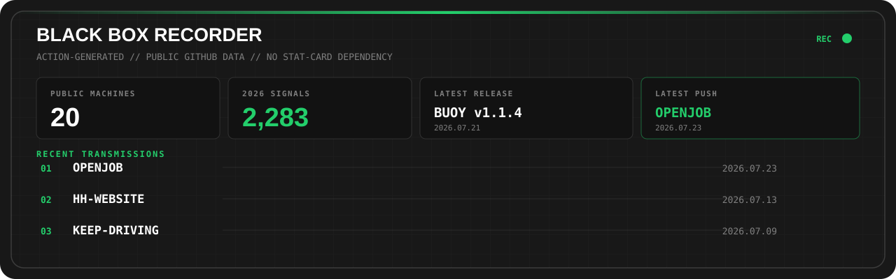

  

  <samp>DALLAS // N00B UNTIL PRODUCTION SAYS OTHERWISE // PROOF &gt; VIBES</samp>

I build systems that keep things moving—**Macs awake, projects alive, cars rolling, teams shipping, and tiny languages talking.**

The pattern is usually the same: find recurring friction, learn whatever the machine demands, ship the smallest real version, then keep pulling the thread.

## CURRENT HEIST

### [OPENJOB →](https://openjob.dev)

One clear shared Task List for small working Groups. Production **web app + authenticated API + installable CLI + PWA**, built as one system instead of four demos. The current mutation: native iOS and Android clients.

[`SOURCE`](https://github.com/scwlkr/openjob) · [`RELEASES`](https://github.com/scwlkr/openjob/releases) · [`MOBILE ROADMAP`](https://github.com/scwlkr/openjob/issues/33)

## THE MACHINES ARE CONNECTED

  

<table>
  <tr>
    <td width="33%" valign="top">
      <strong>01 / BUILT A LANGUAGE</strong>  
      <a href="https://github.com/scwlkr/WalkLang"><strong>WalkLang</strong></a>
      compiles indentation-based source through generated C into native
      executables. Then I wrote
      <a href="https://github.com/scwlkr/PicoNet"><strong>PicoNet</strong></a>,
      a tiny terminal chatbot, entirely in it.
    </td>
    <td width="33%" valign="top">
      <strong>02 / TAMED A MAC</strong>  
      <a href="https://github.com/WLKRLABS/buoy"><strong>Buoy</strong></a>
      is a Swift CLI + AppKit dashboard that keeps a Mac awake without lying
      about the machine's real power state.
    </td>
    <td width="33%" valign="top">
      <strong>03 / MADE VIDEO LESS ANNOYING</strong>  
      <a href="https://github.com/scwlkr/tellygrab"><strong>tellygrab</strong></a>
      turns a YouTube URL into editor-ready ProRes or WAV—and reveals a tiny
      ASCII television while it works.
    </td>
  </tr>
  <tr>
    <td width="33%" valign="top">
      <strong>04 / WORLDS IN PROGRESS</strong>  
      <a href="https://github.com/scwlkr/UQIQ"><strong>UQIQ</strong></a>
      is a fake-IQ mobile game that judges you for fun.
      <a href="https://github.com/scwlkr/keep-driving"><strong>Keep Driving</strong></a>
      is a working-title survival-driving roguelite prototype.
    </td>
    <td width="33%" valign="top">
      <strong>05 / AGENT MENAGERIE</strong>  
      Factories, commanders, and persistent little creatures:
      <a href="https://github.com/scwlkr/Vampyre">Vampyre</a>,
      <a href="https://github.com/scwlkr/maker">Maker</a>,
      <a href="https://github.com/scwlkr/contubernium">Contubernium</a>, and
      <a href="https://github.com/scwlkr/OpenAlfredo">OpenAlfredo</a>.
    </td>
    <td width="33%" valign="top">
      <strong>06 / SOFTWARE IN THE WILD</strong>  
      The lab spills into real operations:
      <a href="https://github.com/scwlkr/HH-Website">HH</a>,
      <a href="https://www.dffwdaily.com">DFFW Daily</a>,
      <a href="https://github.com/scwlkr/QuickBrakeRepair">Quick Brake Repair</a>,
      and small tools that remove one ridiculous step.
    </td>
  </tr>
</table>

## LIVE FEED

  

Regenerated by this repo's own <a href="./.github/workflows/update-black-box.yml">GitHub Action</a> from public GitHub data. No rented stat-card server. The <a href="./scripts/build-black-box.mjs">recorder is inspectable</a>.

  
<strong>OPEN THE OPERATOR DOSSIER</strong>

   

  - **Base:** Dallas, Texas.
  - **Languages:** TypeScript/JavaScript, Swift, Python, C++/C, GDScript, shell, and the occasional self-inflicted language.
  - **Machinery:** macOS, Godot, Cloudflare, Firebase, GitHub Actions, Codex, terminals, physical-device tests, and whatever closes the loop.
  - **Operating rule:** if the workflow repeats, it is auditioning to become software.
  - **Side quests:** [PaletteWOW](https://github.com/scwlkr/paletteWOW), [skillsies](https://github.com/scwlkr/skillsies), [ctb-translator](https://github.com/scwlkr/ctb-translator), and [Walk The World](https://github.com/scwlkr/Walk-The-World).

 

  <a href="https://scwlkr.com"><strong>SCWLKR.COM</strong></a>
  &nbsp;·&nbsp;
  <a href="https://github.com/scwlkr?tab=repositories"><strong>ALL MACHINES</strong></a>
  &nbsp;·&nbsp;
  <a href="https://github.com/scwlkr/openjob"><strong>CURRENT OBSESSION</strong></a>

